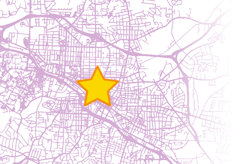

<!-- Hero photo -->
<video src="media/banner.mp4" autoplay> </video>

<h4 style="font-family: 'Passion One', sans-serif; text-align: left; padding-top: 50px; padding-left: 75px;" class="black-text">Durham's Own League</h4>
<h6 style="color:black; font-size:18px; line-height: 150%; padding-left: 50px; text-align: left; padding-right: 50px;">We're here! A lot of us are queer, and we want you to join us. BCRD was
founded in 2015 by a couple of skaters who thought that a community as vibrant as Durham deserved its own roller derby league. Since then, we’ve grown from five skaters doing laps
in the back of the Ponysaurus warehouse to a group of over thirty skaters who practice,
scrimmage, and bout together – and we’re growing all the time!
</h6>

