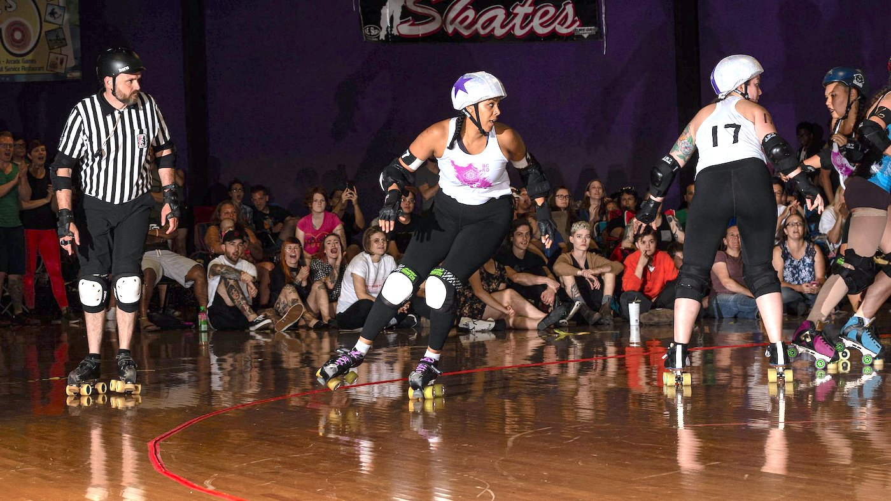

<!-- Hero photo -->

<h1 style="font-family: 'Dosis', sans-serif; font-style: bold; text-align: center; " class="gray-text">BULL CITY ROLLER DERBY</h1> 

  

        

        <h4 style="font-family: 'Dosis', sans-serif; font-style: bold; text-align: left; " class="gray-text">WHO WE ARE</h4>
        
We're here! A lot of us are queer, and we want you to join us. BCRD was
        founded in 2015 by a couple of skaters who thought that a community as vibrant as Durham deserved its own roller derby league. Since then, we’ve grown from five skaters doing laps
        in the back of the Ponysaurus warehouse to a group of over thirty skaters who practice,
        scrimmage, and bout together – and we’re growing all the time!
        

        

         
        

        <h4 style="font-family: 'Dosis', sans-serif; font-style: bold; text-align: left; " class="gray-text">JOIN US!</h4>
        

        We're the first Durham-based roller derby league and we want you! We're open to all women-identified, nonbinary, and gender non-conforming folx
          who want to skate fast, hit hard and get down and derby. Email bullcityrollerderby@gmail.com for more info and/or read our recruitment packet <a class="blue-text" href="media/Recruitment- Welcome Document.pdf">here</a>.

          

  

  

        

        <h4 style="font-family: 'Dosis', sans-serif; font-style: bold; text-align: left; " class="gray-text">SPONSORS</h4>
         

        <h5 style="font-family: 'Dosis', sans-serif; text-align: center; color:gray">Founding Sponsor</h5>
        
 

         
        <h5 style="font-family: 'Dosis', sans-serif; text-align: center; color:gray">General Sponsors</h5>

        
<a class="center-align blue-text" style="font-family: 'Dosis', sans-serif; color:gray " href="https://www.sofiaspizzadurham.com/">Sofia's Pizza</a>

        

        <a class="center-align blue-text" style="font-family: 'Dosis', sans-serif; color:gray" href="https://www.graysquirrelcoffee.com/">Gray Squirrel Coffee Co</a>

		

		<a class="center-align blue-text" style="font-family: 'Dosis', sans-serif; color:gray" href="http://www.bruisedboutique.com/onlinestore/?fbclid=IwAR3FDutNglJ-tzjkulCYkNF5GzSQjfMMSma8entb_8ToCsXxEKOQdV5QISk">Bruised Boutique</a>

  

  

